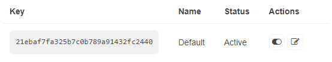
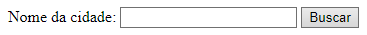
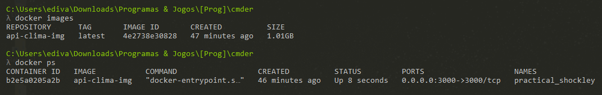
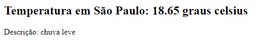

# Avaliação da Sprint 2
> Consumo de API pública através do Node.js

 Nesta avaliação foram utilizados os conceitos estudados ao longo da Sprint 2, para implementar o consumo de uma API pública através do Node.js.

 Foi escolhida para ser implementada a __OpenWeather__, um serviço online, de propriedade da OpenWeather Ltd, que fornece dados meteorológicos globais via API, incluindo dados meteorológicos atuais, previsões, previsões e dados meteorológicos históricos para qualquer localização geográfica.


Disponível em: https://openweathermap.org

## Ferramentas/plataformas utilizadas
* Node.js
* Docker
* Visual Studio Code/VS Code
* Github

## Objetivos
* Na prática que segue é criado um aplicativo JavaScript, usando _Node.js_ e o framework _Express_.
* Este aplicativo nos mostrará informações climáticas sobre determinada cidade, que será fornecida através de um formulário, ao visitarmos o _[localhost:3000](https://localhost:3000)_.
* Nesta prática é utilizado o VS Code para implementar o passo-a-passo a seguir, onde editamos os scripts necessários e rodamos os comandos ligados ao Node.js e Docker.
* Para encerrar o aplicativo é enviado ao repositório no Github.

## Passo-a-passo

### Parte 1 - Plataforma OpenWeather

* Inicialmente nos registramos no site da [OpenWeather](https://home.openweathermap.org/users/sign_up).
* Em seguida buscamos nossa [chave](https://home.openweathermap.org/api_keys) para acesso à API. Como segue abaixo:

* Por último acessamos a página com a documentação das chamadas dos dados meteorológicos atuais ([Current Weather Data](https://openweathermap.org/current)).
* Escolhemos uma chamada para solicitação da API integrada, pelo nome da cidade:
```sh
https://api.openweathermap.org/data/2.5/weather?q={city name}&appid={API key}
```
* Adicionamos à chamada os parâmetros de _unidade_ e _linguagem_, para obtermos os dados em graus celsius e com idioma em português brasileiro.

### Parte 2 - Desenvolvimento - Bibliotecas

* Criamos um diretório para nossa aplicação (api_clima).
* Com o auxílio do terminal integrado do VS Code, rodamos o comando a segui para inicializar nosso projeto:
```sh
npm init
```
* Dessa forma adicionamos o arquivo **package.json**, que contém informações sobre nossos projetos, como scripts, dependências e versões.
* Em nosso projeto instalamos as bibliotecas utilizadas com o comando:
```sh
npm install express, nodemon, body-parser
```
* Detalhes sobre as bibliotecas:
    * **express**: framework para Node.js que fornece recursos mínimos para construção de servidores web.
    * **nodemon**: ferramenta que reinicia automaticamente o aplicativo do node ao detectar qualquer alteração.
    * **body-parser**: usada para obter dados do formulário, assim o cliente externo poderá enviar informações para nossa aplicação.
* Estas bibliotecas são adicionadas como dependências no nosso arquivo package.json.
* É feita uma pequena alteração no nosso arquivo package.json, na seção de scripts, para que possamos executar o código de forma recursiva com o nodemon:
```json
"scripts": {
    "start": "nodemon app.js",
    "test": "echo \"Error: no test specified\" && exit 1"
}
```

### Parte 3 - Desenvolvimento - Códigos

* Em nosso front-end temos um simples formulário com a seguinte estrutura:
```html
<form action="/" method="post">
    <label for="cityInput">Nome da cidade:</label>
    <input type="text" name="cityInput" id="cityInput">
    <button type="submit">Buscar</button>
</form>
```
* Esse formulário receberá do cliente o nome de uma cidade em seu campo *input*, essa informação será enviada para nossa aplicação através do método *post*. Tendo a seguinte aparência:


* Quanto a nossa back-end, temos a aplicação **app.js**, sua estrutura inicia-se com a importação e instanciação de nossas bibliotecas:

```js
const { response } = require('express');
const express = require('express');
const https = require('https');
const bodyParser = require('body-parser');
const app = express();
```

* Em seguida usamos o body-parser para trabalhar com os dados recebidos do cliente, através do formulário:

```js
app.use(bodyParser.urlencoded({extended:true}));
```

* Servimos nosso arquivo **index.html**, quando feita uma solicitação ao servidor:

```js
app.get('/', (req, res) => {
    res.sendFile(__dirname + "/index.html");
});
```

* Requisitamos as informações climáticas à API, através do seguinte bloco de códigos:

```js
app.post('/', (req, res) => {

    // Constantes: nome da cidade, chave API, URL da chamada
    const query = req.body.cityInput;
    const apiKey = '21ebaf7fa325b7c0b789a91432fc2440';
    const url = `https://api.openweathermap.org/data/2.5/weather?q=${query}&appid=${apiKey}&units=metric&lang=pt_br`;

    // Recebemos os dados da API através de uma solicitação HTTPS
    https.get(url, (response) => {
        response.on('data', (data) => {
            const weatherData = JSON.parse(data);
            const temp = weatherData.main.temp;
            const description = weatherData.weather[0].description;
            res.send(`<h2>Temperatura em ${query}: ${temp} graus celsius</h2><p>Descrição: ${description}</p>`);
        });
    });

});
```

* Para concluir nosso arquivo **app.js**, setamos a porta onde nossa aplicação estará rodando/ouvindo:

```js
app.listen(3000, () => console.log("Nosso server está rodando na porta 3000..."));
```
* Por último realizamos a conteinerização do nosso projeto com o auxílio do Docker, estrutura do arquivo Dockerfile:
```docker
FROM node:latest
WORKDIR /app
COPY package.json /app
RUN npm install
COPY . /app
CMD ["npm", "start"]
```

* Construímos nossa imagem através do comando:
```docker
docker build -t api-clima-img .
```

* Executamos o docker container usando a imagem criada, pelo comando:
```docker
docker run -d -p 3000:3000 -v api-clima-vol:/app api-clima-img
```

* Ao término dos comando anteriores, temos o seguinte cenário:



## Conclusão
* Ao acessarmos nosso localhost na porta 3000, iremos para nossa **index.html** onde passaremos uma cidade por formulário.
* Nossa aplicação então retorna os dados obtidos pela API acerca do clima na cidade definida.
* Segue exemplo do retorno da aplicação:



## Autor
* [@EdivalcoAraujo](https://github.com/EdivalcoAraujo)