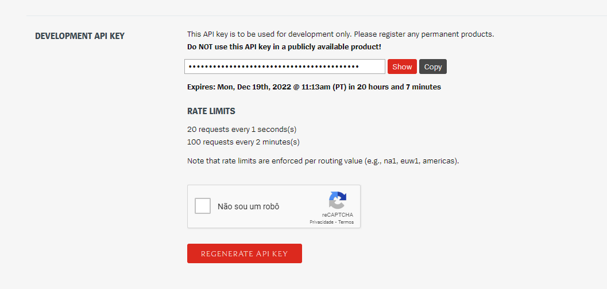

# Avaliação - Sprint 2
Nesse projeto foi criado uma aplicação simples que realiza requisições para a API pública da [Riot Games](https://developer.riotgames.com), onde é possível  pesquisar por usuários do jogo [League of Legends](https://www.leagueoflegends.com/pt-br/). São retornadas as informações do nível do usuário, seu "rank" em um modo de jogo e quantidade de vitórias e derrotas totais em partidas nesse modo de jogo.

## Como a API funciona
API significa interface de programação de aplicação, através dela é possível realizar a comunicação entre plataformas seguindo certas normas e padrões, onde pode haver o compartilhamento e/ou manipulação de dados através da API. 

As APIs funcionam usando as 'requests' e 'responses'. Quando uma API solicita informações de aplicativo web ou servidor da web, ela receberá uma resposta. O local em que as APIs enviam solicitações e onde o recurso é armazenado é chamado de endpoint. Um endpoint é um ponto no qual uma API se conecta com uma aplicação, um endpoint pode ser uma URL de um servidor ou serviço. 

No caso desta aplicação, é usado apenas o método de requisição HTTP do tipo GET, onde é solicitado a API o retorno de dados específicos. Porém, existem outros tipos de métodos HTTP, os mais comuns além do GET são:
  - POST: requisição para inserção de dados;
  - PUT: requisição para modificação de dados;
  - DELETE: requisição para exclusão de dados.

Na API utilizada é necessário criar uma conta na plataforma para que seja possível gerar uma chave de autenticação para realizar o acesso.

## Como gerar uma chave
1. Acesse o [site da API]([https://developer.riotgames.com) e clique em *"Login"* no canto superior direito:


2. Você será redirecionado para a página de login da Riot Games. Caso não possua uma  conta, vá em *"Create account"* na parte inferior e crie a sua.

3. Após feito o login, você será redirecionado para a página de dashboard, onde é possível ver ou gerar uma nova chave. Para gerar uma nova chave utilize o botão *"Regenerate Api Key"*. Você pode ver o código ao clicar em *"Show"* e/ou copiá-lo com o botão *"Copy"*.



## Como utilizar
1. Utilize o comando abaixo para instalar todas as dependências do projeto:
```
npm install
```

2. Agora utilize esse comando para iniciar o servidor com o nodemon:
```
npm run dev
```
3. Abra http://localhost:3333 no navegador e agora deve ser possível pesquisar por summoners :)

**Obs.:** 🚨 Cada chave de API após ser gerada tem um prazo de cerca de 24h para expirar, portanto confira a validade da sua em caso de erro ao tentar realizar pesquisas.

## Estrutura do código
Após criado o diretório do projeto, o seguinte comando foi utilizado para adicionar o arquivo *package.json*.
```
npm init
```
Após configurar as informações da aplicação no package.json, o arquivo ficou assim:

```
{
  "name": "summoner-finder",
  "version": "1.0.0",
  "description": "Aplicação que permite pesquisar por summoners/usuários no jogo League of Legends",
  "main": "app.js",
  "scripts": {
    "test": "echo \"Error: no test specified\" && exit 1"
  },
  "repository": {
    "type": "git",
    "url": "git+https://github.com/Compass-pb-aws-2022-IFCE/sprint-2-pb-aws-ifce.git"
  },
  "keywords": [
    "league",
    "of",
    "legends",
    "lol",
    "summoner",
    "search"
  ],
  "author": "Dayanne Bugarim",
  "license": "ISC",
  "bugs": {
    "url": "https://github.com/Compass-pb-aws-2022-IFCE/sprint-2-pb-aws-ifce/issues"
  },
  "homepage": "https://github.com/Compass-pb-aws-2022-IFCE/sprint-2-pb-aws-ifce#readme"
}
```
Agora são instalados os pacotes necessários para o desenvolvimento
```
npm install express express-handlebars axios
```
- express: para facilitar o desenvolvimento da aplicação;
- express-handlebars: para renderizar as páginas HTML nas rotas;
- axios: para realizar as requisições.

E também as dependência de desenvolvimento
```
npm install dotenv nodemon -D
```
- dotenv: para carregar as variáveis de ambiente do arquivo *.env* no objeto *process.env.*
- nodemon: para manter o servidor atualizado a cada modificação.

Agora é necessário adicionar um script no package.json para que a aplicação rode pelo nodemon, assim não será necessário reiniciar o servidor toda vez que ocorrer alguma mudança.
```
"scripts": {
    "dev": "nodemon app.js"
},
```
### .env
Nesse arquivo são setadas as variáveis de ambiente que serão utilizadas para realizar as requisições. A LOL_KEY contém a chave de autenticação, LOL_URL contém a URL base para realizar as requisições e LOL_ICONS para pesquisar e retornar o ícone do usuário atráves do seu ID.
```
LOL_KEY={chave}
LOL_URL=https://br1.api.riotgames.com
LOL_ICONS=http://ddragon.leagueoflegends.com/cdn/12.23.1/img/profileicon
```

### app.js
No arquivo principal da aplicação é especificada a porta em que o servidor irá rodar, setada a pasta views onde está localizado os templates HTML e qual será o template principal da aplicação.

É especificado o diretório public que irá conter os arquivos estáticos, como o arquivo css e imagens, e na rota principal é setado que o arquivo index da view será renderizado quando essa rota for acessada.

Por fim, é chamada a pasta de rotas que contém a rota /summoner.
```
const express = require('express');
const app = express();
const exphbs = require('express-handlebars');
const path = require('path');
require('dotenv').config();

const port = 3333;

app.listen(port, () => {
    console.log(`Rodando em http://localhost:${port}`);
});

app.set('views', path.join(__dirname, 'views'));
app.engine('handlebars', exphbs.engine({ defaultLayout: 'main' }));
app.set('view engine', 'handlebars');

app.use(express.static(path.join(__dirname, 'public')));

app.get('/', (req, res) => {
    res.render('index');
});

app.use('/summoner', require('./routes/summoner'));
```
### Routes - Summoner
Aqui é realizada toda a lógica para a requisição e manipulação dos dados recebidos. Será utilizado o express, o gerenciador de rotas do express e o axios.

Inicialmente foi criada uma função para checar o modo de jogo e então retornar uma string formatada.
```
const express = require('express');
const router  = express.Router();
const axios = require('axios');

const checkQueueType = (type) => {
    switch (type) {
        case 'RANKED_SOLO_5x5':
            return 'Solo/Duo';
            break;
        case 'RANKED_FLEX_SR' || 'RANKED_TEAM_SR' :
            return 'Flex';
            break;
        case 'RANKED_TFT_DOUBLE_UP':
            return 'TFT'
            break;
        default:
            return 'Sem Dados';
    };
}
```
Agora é criada uma rota de GET para summoner. A constante summonerName vai receber o valor do input da pesquisa (possui o name="**summoner**", por isso recebe res.query.**summoner**) para ser utilizada como variável na url da primeira requisição.

A urlGetSummoner recebe a url para fazer a pesquisa pelo nome do usuário. É declarado o objeto config, contendo o objeto headers, que será fornecido como argumento ao fazer requisições com a chave de autenticação.

A summonerIdResponse recebe a promise de uma solicitação GET usando o axios com a url e a configuração como parâmetros. Se ocorrer algum erro ele será retornado através do .catch, senão os dados retornados serão armazenados em variáveis com nomes correspondentes. Essa requisição retorna as informações mais importantes e, principalmente, o id do usuário, que será necessário para conseguir informações mais detalhadas dele em uma requisição posterior.

```
router.get('/', async (req, res) => {
    const summonerName = req.query.summoner;

    const urlGetSummoner = `${process.env.LOL_URL}/lol/summoner/v4/summoners/by-name/${summonerName}`;

    const config = { headers: { 'X-Riot-Token': process.env.LOL_KEY }}

    const summonerIdResponse = await axios.get(urlGetSummoner, config)
    .catch(err => {
        return err;
    })

    const { id, name, profileIconId, summonerLevel} = summonerIdResponse.data;
```
Agora a urlGetRanked receberá outra url de endpoint recebendo o id do usuário para retornar as informações de partidas ranqueadas e então será feita a requisição.

Nesse endpoint, o retorno pode haver mais de um tipo de ranked, por tanto é necessário fazer um ternário para adicionar as informações do primeiro objeto, caso exista, ou do segundo em variáveis correspondentes aos dados recebidos.

A função para checar o tipo de jogo que foi criada lá no início é finalmente utilizada e seu retorno é armazenado numa variável. Essa variável e todos os outros dados finais são armazenados no objeto summoner.

Por fim, o template summoner será rederizado junto com o objeto summoner e o módulo router é exportado para ser utilizado no app.js.

```
    const urlGetRanked = `${process.env.LOL_URL}/lol/league/v4/entries/by-summoner/${id}`;

    const responseRanked = await axios.get(urlGetRanked, config)
    .catch(err => {
        return err;
    })

    const { tier, rank, wins, losses, queueType } = responseRanked.data[0] ? responseRanked.data[0] : responseRanked.data[1];

    const formattedQueueType = checkQueueType(queueType);

    const summoner = {
        name,
        summonerLevel,
        tier,
        rank,
        wins,
        losses,
        formattedQueueType,
        iconUrl: `${process.env.LOL_ICONS}/${profileIconId}.png`,
        winRate: ((wins / (wins + losses)) * 100).toFixed(1)
    }
    
    res.render('summoner', { summoner })
})

module.exports = router;
```

### Views - Main.handlebars
Esse é o template principal e será renderizado em qualquer rota. Contém basicamente o título da aplicação e o campo para realizar as pesquisas. O {{{ body }}} receberá outros templates de acordo com o que a rota renderizar.
```
...
<body>
    <header>
        <h1>Summoner Finder</h1>
        <form action="/summoner" method="GET" id="search-form">
            <input type="text" id="summoner-search" name="summoner" placeholder="Procure um summoner...">
            <button id="search-button" type="submit">
                
            </button>
        </form>
    </header>
    {{{ body }}}
</body>
...
```

### Views - Summoner.handlebars
Template HTML que irá renderizar as informações recebidas pelas requisições. O objeto summoner que foi criado e "enviado" pelo res.render para esse template é utilizado através das chaves triplas, chamando as propriedades do objeto.
```
<main>
    ...
            <div class="summoner-main-informations">
                <div class="summoner-name-level">
                    <h2>
                        {{{ summoner.name }}} ({{{ summoner.summonerLevel }}})
                    </h2>
                </div>
            </div>
    ...
</main>
```