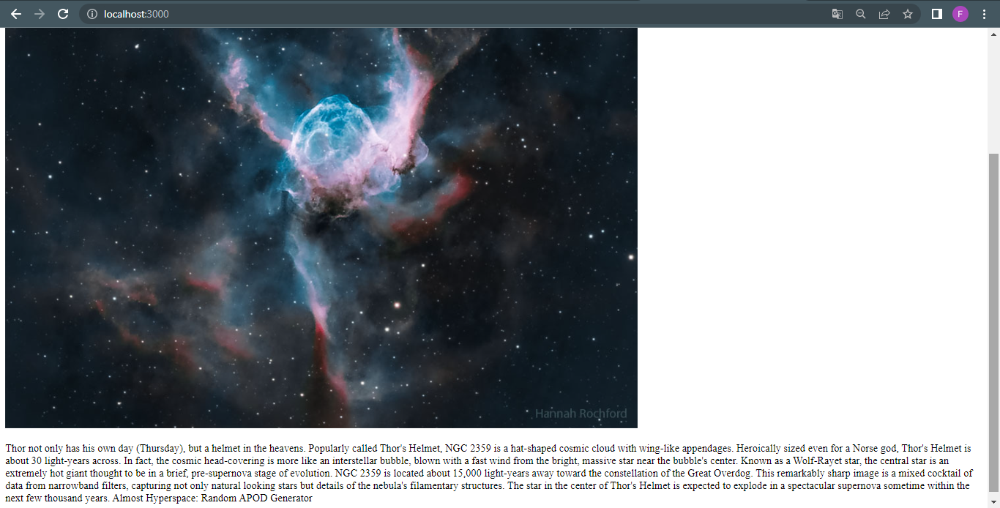

# Avaliação da Sprint 2 - Consumindo API
## O que é uma API?
Uma _application programming interface_ (API) é um conjunto de definições e protocolos que permitem a integração de sistemas e possibilitando a reutilização de seus conteúdos e funcionalidades por outros softwares.
## Aplicação Escolhida
para esta tarefa, utilizei a api [api.nasa.gov](https://api.nasa.gov/), espeficamente a sua feature da imagem do dia, a qual retorna uma imagem temática com sua respectiva descrição, variando de acordo com a data de acesso.
## Na Prática

1 . Após abrir o terminal na pasta onde se econtram os arquivos, instale as dependências necessárias com o comando:
```
npm i express express-handlebars  request nodemon body-parser 
```
2 . Em seguia, utilize o comando abaixo para iniciar a aplicação, a qual poderá ser visualizada pelo navegador no endereço _localhost:3000_.
```
npm start
```
## Exemplo:


##